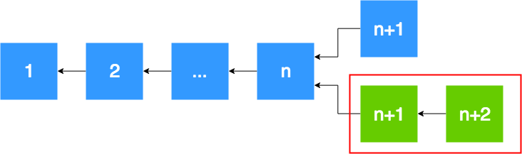

# Reference

## Language Support

The Hycon wallet currently supports the following languages, and can generate valid BIP39 mnemonic phrases using any of these supported languages:

Language | `value`
---------|------------
CHINESE SIMPLIFIED | `chinese_simplified`
CHINESE TRADITIONAL | `chinese_traditional`
ENGLISH **(default)** | `english`
FRENCH | `french`
ITALIAN | `italian`
JAPANESE | `japanese`
KOREAN | `korean`
SPANISH | `spanish`

## Blockchain Reorganization

In the event of a _blockchain reorganization_, similar to that in Bitcoin, subscriptions will receive one or more blocks that were previously thought to be in the difficultywise-longest well-formed blockchain. These blocks will be returned as a result of a new difficultywise-longest well-formed blockchain.

<figure>
    </img>
    <b><i>Figure 1</i></b> | In the event of a subscription trigger from a reorganization, the blocks inside the red box will be returned, wherein the height of the new difficultywise-longest well-formed blockchain is higher than the other.
</figure>

## Changelog

Date | Maintainer | Description
-----|------------|------------
1542344490 | [Shawn Lee](mailto:shawn@glosfer.com) | fixed typos and updated responses.
1542263602 | [Shawn Lee](mailto:shawn@glosfer.com) | updates to `api/v1`. `beta-0.01` release in English.
